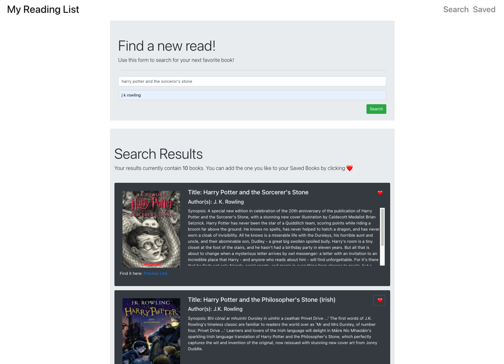
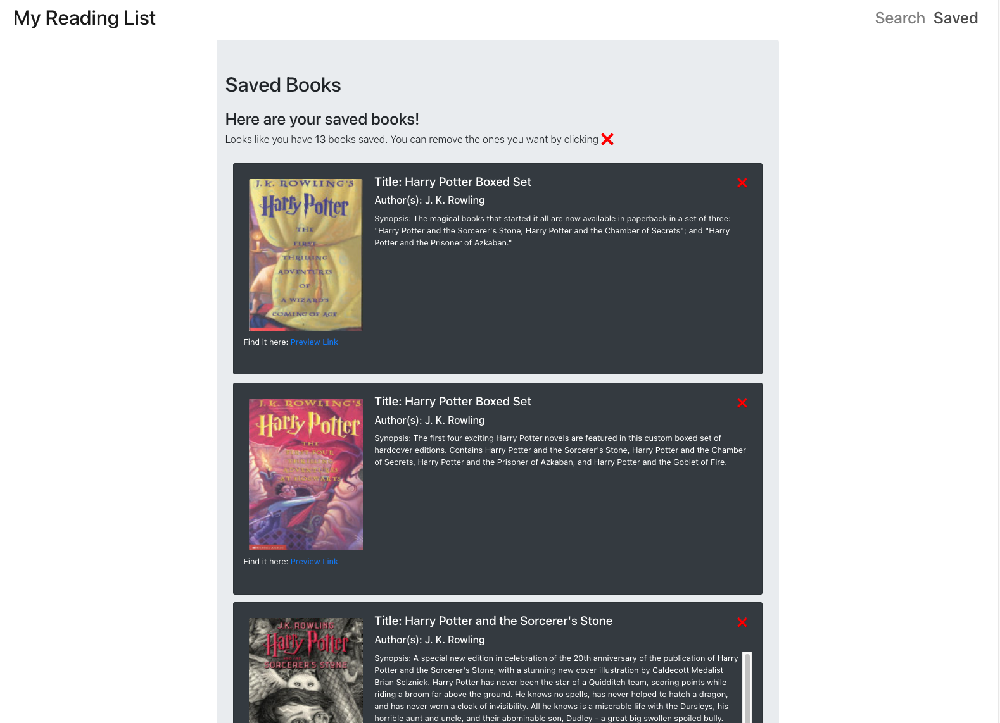

    <h3 align="center">My Reading List</h3>
     
    

    Find and add books to read!
     
     
    <a href="https://wdfhai-my-reading-list.herokuapp.com/">View Demo</a>
    

 

    
Table of Contents

    <ol>
        <li><a href="#about-the-project">Description</a></li>
        <li><a href="#built-with">Built With</a></li></li>
        <li><a href="#installation">Installation</a></li>
        <li><a href="#usage">Usage</a></li>
        <li><a href="#contributing">Contributing</a></li>
        <li><a href="#license">License</a></li>
        <li><a href="#contact">Contact</a></li>
        <li><a href="#summary">Summary</a></li>
    </ol>

### Description

This MERN application is designed to search for books using the Google Books API, and then choose books to save to a serverside database for recall.

### Built With

Following languages, frameworks and libraries were used in the development of this project:

- HTML, CSS, JavaScript
- Bootstrap, REACT, Node, Express, AXIOS, Mongoose

### Installation

No installation required client side, as the app is deployed to Heroku.

### Usage

Search for books using the search form. Save the books you like and see them on the Saved page. You can also delete books you have already read from the saved page.

### Contributing

Contributions are what make the open source community such an amazing place to learn, inspire, and create. Any contributions you make are **greatly appreciated**.

1. Fork the Project
2. Create your Feature Branch
3. Commit your Changes
4. Push to the Branch
5. Open a Pull Request

### License

This project is using the following license: MIT

### Contact

You can reach me for any questions or comments at the following:

- Look me up on Github, where my username is <a href="https://github.com/wdfhai">wdfhai</a>.
- Reach out to me through email at wd.fhai@outlook.com.
- Find me on Twitter at @wdfhai.

### Summary

Thank you for checking out my first MERN application. Special thanks to the Google Books API. Cheers!
